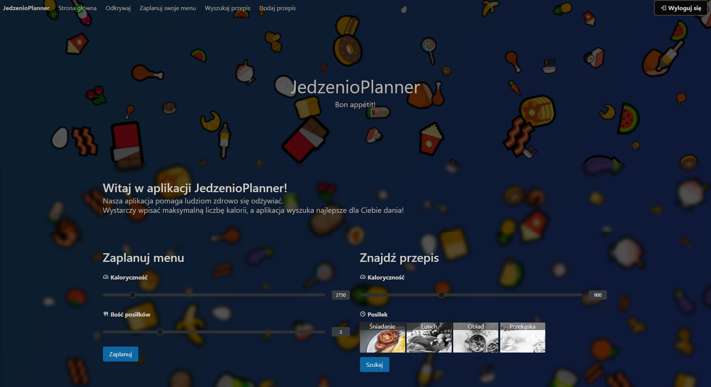
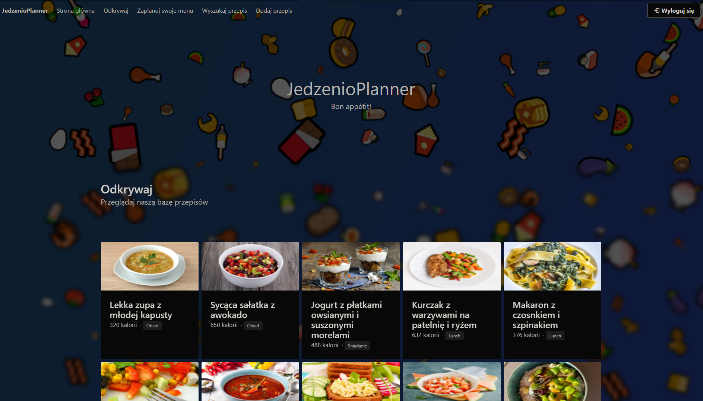
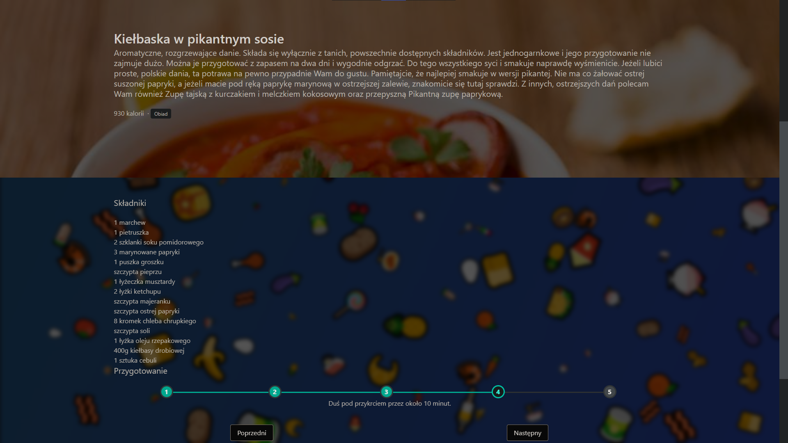
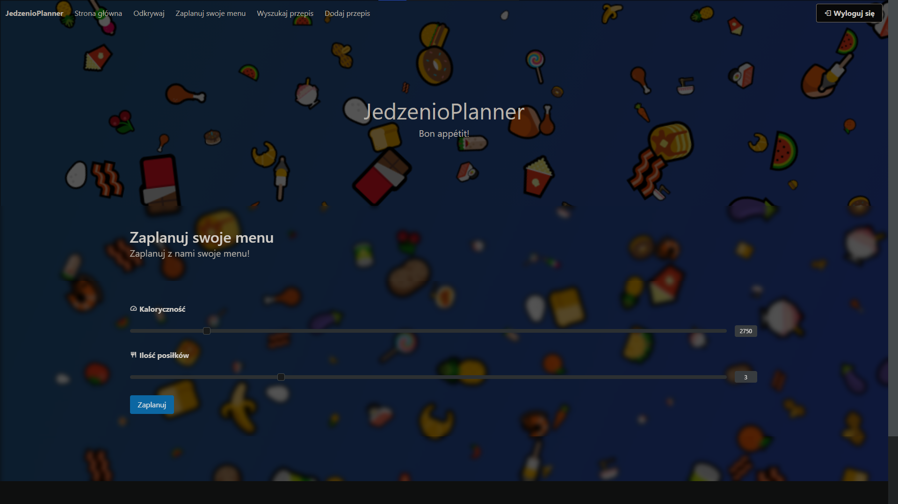
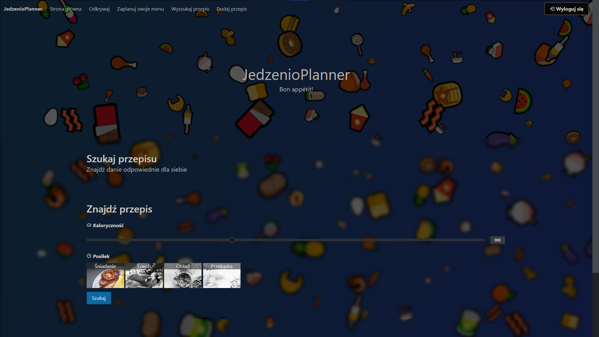
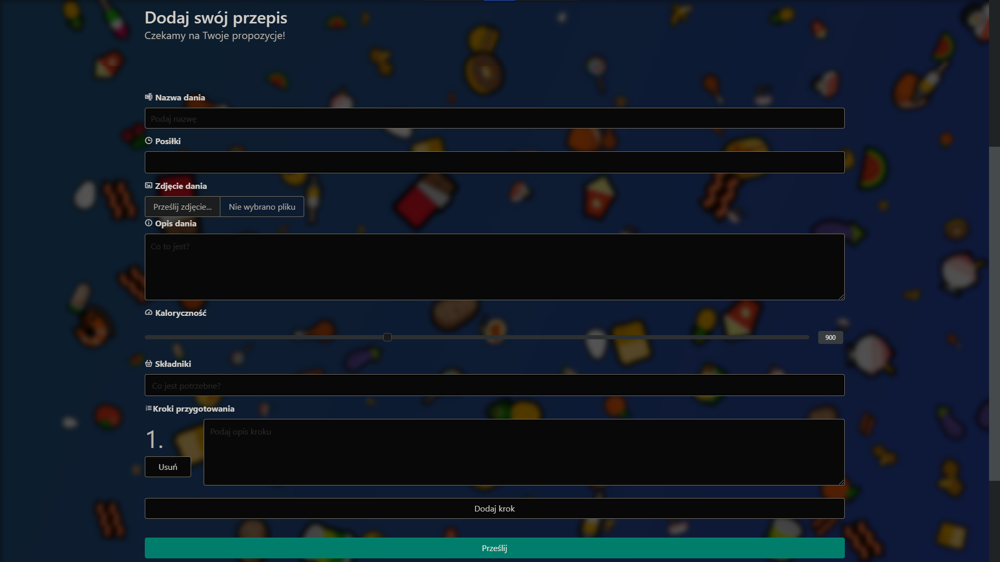

# JedzenioPlanner Web
Aplikacja internetowa będąca częścią projektu JedzenioPlanner. Pozwala na przeglądanie, wyszukiwanie oraz dodawanie przepisów. Korzysta z JedzenioPlanner API.
## Instalacja
Umieść wszystkie pliki i katalogi na serwerze, tak aby były dostępne z poziomu katalogu głównego `/`.
Aby aplikacja działała, należy również zainstalować i uruchomić [JedzenioPlanner API](https://github.com/JedzenioPlanner/JedzenioPlanner.Api).
## Korzystanie
### Strona główna
Po uruchomieniu aplikacji, oczom użytkownika ukazuje się strona główna. Zawiera ona krótki opis, czym jest aplikacja oraz formularze: planowania dziennego menu i wyszukiwania przepisu.

Aby zaplanować swoje dzienne menu, należy w formularzu "Zaplanuj menu" ustawić oczekiwaną łączną kaloryczność swojego jadłospisu oraz ilość posików wchodzących w jego skład. 
Można również wyszukać pojedynczy przepis, ustawiając w formularzu "Znajdź przepis" oczekiwaną kaloryczność oraz wybierając, do jakiego posiłku ma być.
### Funkcja Odkrywaj

Funkcja Odkrywaj umożliwia swobodne przeglądanie bazy danych aplikacji JedzenioPlanner w poszukiwaniu kulinarnych inspiracji.
Po przejściu do podstrony Odkrywaj za pomocą menu głównego, pojawiają się losowo wybrane przepisy. Każdy z nich zawiera informacje o kaloryczności, jak i o tym, na który posiłek powinno zostać przygotowane danie. Po kliknięciu na wybrany przepis, otwiera się podstrona ze szczegółami, takimi jak składniki niezbędne do przyrządzenia potrawy oraz kroki przygotowania.

### Planowanie jadłospisu

Aby zaplanować swój całodniowy jadłospis, należy przejść na podstronę Zaplanuj menu lub skorzystać z formularza na stronie głównej. Wystarczy podać oczekiwaną łączną ilość kalorii oraz ilość posiłków do spożycia. Po kliknięciu przycisky Zaplanuj na dole strony pojawi się wygenerowany jadłospis, składający się z wybranej ilości posiłków. Kliknięcia karty z daniem przenosi do widoku szczegółowego danego przepisu.
### Wyszukiwanie pojedynczego przepisu

Aplikacja pozwala również na wyszukanie pojedynczego przepisu o danej ilości kalorii. Wystarczy przejść na podstronę Wyszukaj przepis, podać oczekiwaną kaloryczność oraz wybrać posiłek. Można to również zrobić za pomocą formularza na stronie głównej.
### Dodawanie własnego dania
Zalogowani użytkownicy mogą dodawać własne przepisu do bazy danych.
Aby dodać swoje danie, należy przejść na podstronę Dodaj przepis.
Jeśli użytkownik nie był zalogowany, nastąpi przekierowanie na stronę logowania/rejestracji - istnieje możliwość logowania zarówno adresem e-mail i hasłem, jak i przy pomocy konta Google. 
Po zalogowaniu pokazuje się formularz umożliwiający dodanie przepisu. Należy go wypełnić, podając takie dane, jak nazwa przepisu, kaloryczność, składniki i kroki przyrządzenia.

W przypadku niepoprawnego wypełnienia pola formularza, pokaże się przy nim stosowny komunikat. Po pomyślnym przesłaniu użytkownik zostaje przekierowany na stronę Odkrywaj.